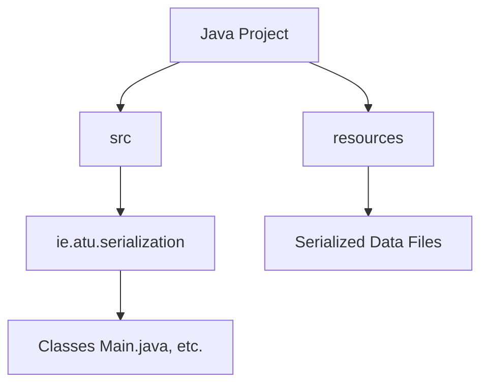
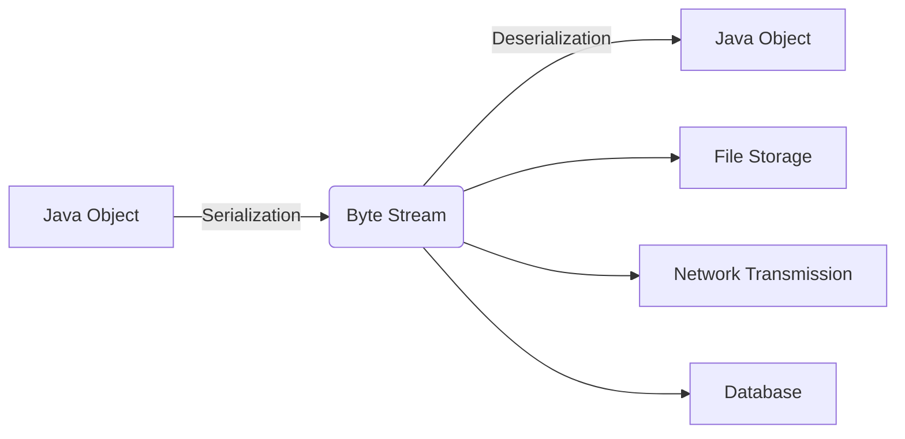
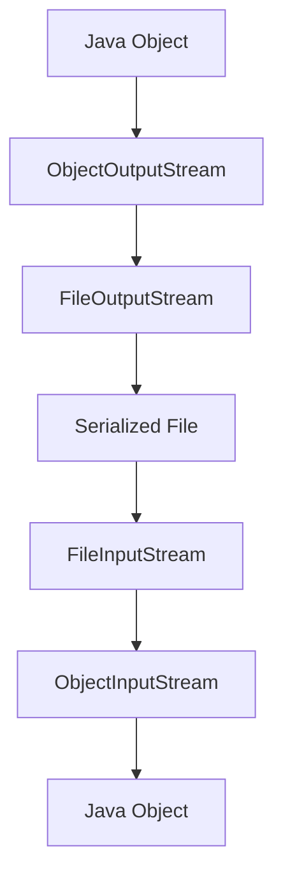
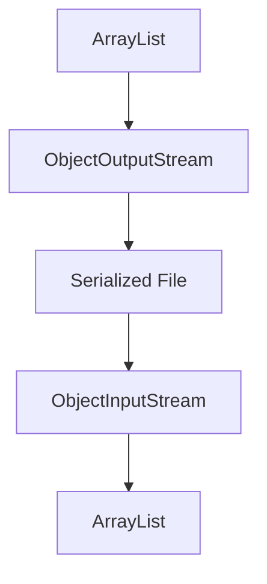
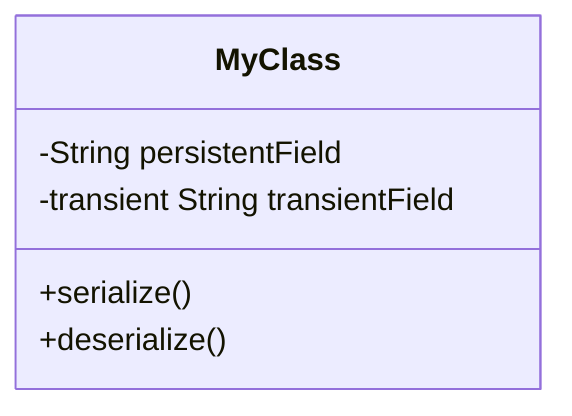
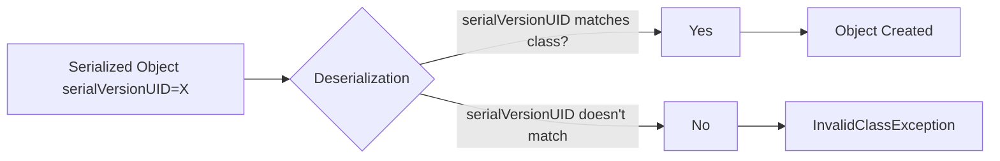
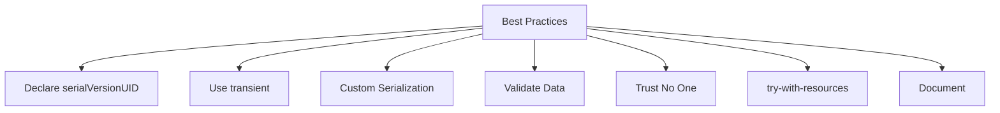
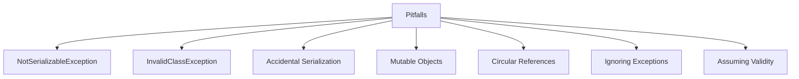

# Java Serialization Lab

## Table of Contents

1. [Project Setup](#1-project-setup)
2. [Introduction to Serialization and Basic Usage](#2-introduction-to-serialization-and-basic-usage)
3. [Serializing Collections](#3-serializing-collections)
4. [Using the `transient` Keyword](#4-using-the-transient-keyword)
5. [Understanding `serialVersionUID`](#5-understanding-serialversionuid)
6. [Best Practices and Common Pitfalls](#6-best-practices-and-common-pitfalls)
7. [Comprehensive DIY Task: Employee Management System](#7-comprehensive-diy-task-employee-management-system)

## 1. Project Setup

### Concept Introduction: Project Structure

Organized projects are maintainable projects.



*   **`src`:** Java source code.
*   **`resources`:** Serialized data.
*   **`ie.atu.serialization`:** Package.

### DIY Task 1: Create Project Structure

1.  Create a new package: `ie.atu.serialization`.
2.  Create a class: `Main` (inside the package).
3.  `Main.java` content:

    ```java
    package ie.atu.serialization;

    public class Main {
        public static void main(String[] args) {
            System.out.println("Serialization Lab Starting...");
        }
    }
    ```
4.  Create a `resources` directory at project root as indicated in the diagram above.

## 2. Introduction to Serialization and Basic Usage

### Concept Introduction: What is Serialization?

Serialization converts a Java object into a byte stream. This allows the object's state to be:

*   **Stored:** Saved to a file.
*   **Transmitted:** Sent over a network.
*   **Persisted:** Stored in a database.

Deserialization is the reverse process: reconstructing the object from the byte stream.

**Why is Serialization Useful?**

*   **Persistence:** Save and load application state.
*   **Deep Copying:** Create truly independent object copies.
*   **Distributed Computing:**  Send objects between different parts of an application, or even different applications running on separate machines (e.g., client-server).

The `Serializable` interface in Java is a *marker interface*.  It has no methods.  A class implements `Serializable` to indicate that it *can* be serialized.  If you try to serialize an object of a class that doesn't implement `Serializable`, you'll get a `NotSerializableException`.

**The Core Process:**

*   **`ObjectOutputStream`:** Writes (serializes) objects to an output stream.  You usually chain this to a `FileOutputStream` to write to a file.
*   **`ObjectInputStream`:** Reads (deserializes) objects from an input stream. You typically chain this to a `FileInputStream` to read from a file.




### Code Example: Serializing a Simple `Person` Object

```java
// File: Person.java
package ie.atu.serialization;

import java.io.Serializable;

public class Person implements Serializable {
    private String name;
    private int age;

    public Person(String name, int age) {
        this.name = name;
        this.age = age;
    }

    @Override
    public String toString() {
        return "Person{name='" + name + "', age=" + age + '}';
    }
}
```

```java
// File: Main.java
package ie.atu.serialization;

import java.io.*;

public class Main {
    public static void main(String[] args) {
        // Create an object to serialize.
        Person person = new Person("Alice", 30);

        // Serialization:
        try (ObjectOutputStream oos = new ObjectOutputStream(new FileOutputStream("resources/person.ser"))) {
            oos.writeObject(person); // This line does the serialization!
            System.out.println("Person object serialized successfully.");
        } catch (IOException e) {
            // Handle potential file I/O errors.
            e.printStackTrace();
        }

        // Deserialization:
        try (ObjectInputStream ois = new ObjectInputStream(new FileInputStream("resources/person.ser"))) {
            Person deserializedPerson = (Person) ois.readObject(); // Read and cast.
            System.out.println("Deserialized Person object: " + deserializedPerson);
        } catch (IOException | ClassNotFoundException e) {
            // Handle file I/O errors and the case where the Person class isn't found.
            e.printStackTrace();
        }
    }
}
```

**Explanation:**

1.  **`implements Serializable`:**  The `Person` class *must* implement `Serializable`.
2.  **`try-with-resources`:** Ensures the streams are closed automatically, even if errors occur.
3.  **`new FileOutputStream("resources/person.ser")`:** Creates a stream to write data to the `person.ser` file.
4.  **`oos.writeObject(person)`:**  This is where the serialization happens. The `person` object is converted to a byte stream and written to the file.
5.  **`new FileInputStream("resources/person.ser")`:** Creates a stream to read data from the `person.ser` file.
6.  **`ois.readObject()`:** Reads the byte stream and reconstructs the object.  We *cast* it to `Person` because `readObject()` returns a generic `Object`.
7.  **Exception Handling:**
    *   **`IOException`:** Can occur during file operations (e.g., file not found, disk full).
    *   **`ClassNotFoundException`:** Can occur during deserialization if the class of the serialized object (`Person` in this case) cannot be found.  This is important for versioning (more on that later).

### DIY Task 2: Serialize a `Book` Object

1.  Create a `Book` class (in the `ie.atu.serialization` package):
    *   Fields: `title` (String), `author` (String), `isbn` (String).
    *   Make sure it `implements Serializable`.
    *   Include a `toString` method for easy printing.
2.  Modify the `Main` class:
    *   Create a `Book` object with some data.
    *   Serialize the `Book` object to a file named `book.ser` in the `resources` directory.
    *   Deserialize the `Book` object from `book.ser`.
    *   Print the deserialized `Book` object to the console to verify it worked.

**Expected Output:** (The "..." will be replaced with your book data)

```
Book object serialized successfully.
Deserialized Book object: Book{title='...', author='...', isbn='...'}
```

## 3. Serializing Collections

### Concept Introduction

Java serialization handles collections (like `ArrayList`, `HashSet`, etc.) seamlessly.  You don't need to do anything special to serialize an entire collection; the serialization process will automatically handle each object within the collection.



### Code Example: Serializing a List of `Person` Objects

```java
// File: Main.java (Modified)
package ie.atu.serialization;

import java.io.*;
import java.util.ArrayList;
import java.util.List;

public class Main {
    public static void main(String[] args) {
        // Create a list of Person objects
        List<Person> people = new ArrayList<>();
        people.add(new Person("Alice", 30));
        people.add(new Person("Bob", 25));

        // Serialize the list
        try (ObjectOutputStream oos = new ObjectOutputStream(new FileOutputStream("resources/people.ser"))) {
            oos.writeObject(people); // Serialize the entire list.
            System.out.println("List of Person objects serialized successfully.");
        } catch (IOException e) {
            e.printStackTrace();
        }

        // Deserialize the list
        try (ObjectInputStream ois = new ObjectInputStream(new FileInputStream("resources/people.ser"))) {
            List<Person> deserializedPeople = (List<Person>) ois.readObject(); // Cast to List<Person>
            System.out.println("Deserialized List of Person objects: " + deserializedPeople);
        } catch (IOException | ClassNotFoundException e) {
            e.printStackTrace();
        }
    }
}
```

### DIY Task 3: Serialize a List of `Book` Objects

1.  Modify your `Main` class:
    *   Create an `ArrayList` to hold `Book` objects (using the `Book` class from the previous task).
    *   Add at least three `Book` objects to the list.
    *   Serialize the entire list to a file named `books.ser` in the `resources` folder.
    *   Deserialize the list from `books.ser`.
    *   Print the deserialized list to the console.

**Expected Output:**

```
List of Book objects serialized successfully.
Deserialized List of Book objects: [Book{...}, Book{...}, Book{...}]
```

## 4. Using the `transient` Keyword

### Concept Introduction

The `transient` keyword is used to indicate that a field should *not* be serialized.  This is important for several reasons:

*   **Security:** You might have sensitive data (like passwords) that you don't want to persist to a file or send over a network.
*   **Non-Serializable Objects:** If a field's type doesn't implement `Serializable`, you can't serialize it directly.  Marking it as `transient` allows the containing object to be serialized.
*   **Temporary/Calculated Fields:** Some fields might represent temporary state or values that can be easily recalculated after deserialization.  There's no need to store them.

When an object is deserialized, any `transient` fields will be initialized to their default values:

*   `null` for object references
*   `0` for numeric primitives (`int`, `double`, etc.)
*   `false` for `boolean`



### Code Example: `User` Class with a `transient` Password

```java
// File: User.java
package ie.atu.serialization;

import java.io.Serializable;

public class User implements Serializable {
    private String username;
    private transient String password; // Transient field: will NOT be serialized
    private int age;

    public User(String username, String password, int age) {
        this.username = username;
        this.password = password;
        this.age = age;
    }

    @Override
    public String toString() {
        return "User{username='" + username + "', password='" + password + "', age=" + age + '}';
    }
}
```

```java
// File: Main.java (Modified)
package ie.atu.serialization;

import java.io.*;

public class Main {
    public static void main(String[] args) {
        // Create a User object
        User user = new User("johndoe", "secret123", 35);

        // Serialize the object
        try (ObjectOutputStream oos = new ObjectOutputStream(new FileOutputStream("resources/user.ser"))) {
            oos.writeObject(user);
            System.out.println("User object serialized successfully.");
        } catch (IOException e) {
            e.printStackTrace();
        }

        // Deserialize the object
        try (ObjectInputStream ois = new ObjectInputStream(new FileInputStream("resources/user.ser"))) {
            User deserializedUser = (User) ois.readObject();
            System.out.println("Deserialized User object: " + deserializedUser); // password will be null
        } catch (IOException | ClassNotFoundException e) {
            e.printStackTrace();
        }
    }
}
```

**Notice:** The `password` field in the deserialized object is `null`, because it was marked as `transient`.

### DIY Task 4: `BankAccount` with `transient` Balance and Transaction History

1.  Create a `BankAccount` class:
    *   Fields: `accountNumber` (String), `accountHolderName` (String), `balance` (double, `transient`), `transactionHistory` (List<String>, `transient`).
    *   Implement `Serializable`.
    *    Include a `toString()` method.
2.  Modify `Main`:
    *   Create a `BankAccount` object.
        *   Add a few strings to its `transactionHistory` (e.g., "Deposit: $100").
    *   Serialize the `BankAccount` to a file.
    *   Deserialize it.
    *   Print the deserialized object.  Verify `balance` is `0.0` and `transactionHistory` is `null`.

**Expected Output:**

```
BankAccount object serialized successfully.
Deserialized BankAccount object: BankAccount{accountNumber='...', accountHolderName='...', balance=0.0, transactionHistory=null}
```

## 5. Understanding `serialVersionUID`

### Concept Introduction

The `serialVersionUID` is a unique identifier for a serializable class. It's used during deserialization to ensure that the serialized data is compatible with the current version of the class loaded in the JVM.

*   **If you *don't* explicitly declare `serialVersionUID`:** The Java runtime will automatically generate one based on the class structure (fields, methods, etc.).  This is *fragile* because any change to the class (even adding a comment or reformatting the code) can change the generated `serialVersionUID`.
*   **If you *do* explicitly declare `serialVersionUID`:** You gain control over versioning. You should change the `serialVersionUID` *only* when you make *incompatible* changes to the class (e.g., removing a field, changing a field's type, changing a field from non-transient to transient).  Adding methods or making other compatible changes does *not* require a `serialVersionUID` change.
*   **If the `serialVersionUID` does not match during deserialization:** An `InvalidClassException` is thrown.  This prevents you from loading data that is incompatible with the current class definition, which could lead to unpredictable behavior or data corruption.

**Best Practice:** Always declare `serialVersionUID` explicitly. You can use the `serialver` tool (part of the JDK) or your IDE to generate an initial value. Most IDEs will have a quick-fix or intention action to add a generated `serialVersionUID` to a class that implements `Serializable`.



### Code Example: `Product` Class with `serialVersionUID`

```java
// File: Product.java (Version 1)
package ie.atu.serialization;

import java.io.Serializable;

public class Product implements Serializable {
    private static final long serialVersionUID = 1L; // Explicitly declared!

    private String name;
    private double price;

    public Product(String name, double price) {
        this.name = name;
        this.price = price;
    }

    @Override
    public String toString() {
        return "Product{name='" + name + "', price=" + price + '}';
    }
}
```

```java
// File: Main.java (Modified)
package ie.atu.serialization;

import java.io.*;

public class Main {
    public static void main(String[] args) {
        // Create and serialize a Product object (Version 1)
        Product product = new Product("Laptop", 1200.00);

        try (ObjectOutputStream oos = new ObjectOutputStream(new FileOutputStream("resources/product.ser"))) {
            oos.writeObject(product);
            System.out.println("Product object serialized successfully.");
        } catch (IOException e) {
            e.printStackTrace();
        }

        // Deserialize the object (assuming the same Product version)
        try (ObjectInputStream ois = new ObjectInputStream(new FileInputStream("resources/product.ser"))) {
            Product deserializedProduct = (Product) ois.readObject();
            System.out.println("Deserialized Product object: " + deserializedProduct);
        } catch (IOException | ClassNotFoundException e) {
            e.printStackTrace();
        }
    }
}
```

### DIY Task 5: Versioning with `serialVersionUID`

1.  **Serialize:** Run the `Main` method above to serialize a `Product` object (Version 1) to `resources/product.ser`.
2.  **Modify `Product` (Incompatible Change):**  Add a new field: `String description;`.  *Do not* change the `serialVersionUID` yet.
3.  **Attempt Deserialization:**  Modify the `Main` method to *only* deserialize the `product.ser` file (remove the serialization part).  Run `Main`.  You should get an `InvalidClassException`. This demonstrates that even a small change can break deserialization if the `serialVersionUID` doesn't match.
4.  **Update `serialVersionUID`:** In the modified `Product` class, change the `serialVersionUID` to `2L`.
5.  **Attempt Deserialization Again:** Run `Main` (still only deserializing). You will *still* get an `InvalidClassException`. This is because the serialized data in `product.ser` is still associated with the *old* `serialVersionUID` (1L).
6.  **Serialize New Version:**  Modify `Main` to create and serialize a *new* `Product` object (using the updated `Product` class with the `description` field and `serialVersionUID = 2L`) to a *different* file, e.g., `resources/product_v2.ser`.
7.  **Deserialize New Version:** Modify `Main` to deserialize from `resources/product_v2.ser`. This should now work correctly, and the `description` field will be `null` (because it wasn't present in the serialized data).
8. **Modify Product (Compatible Change):** Add a new method to the product class `applyDiscount(double percentage)`. Do *not* change the serialVersionUID.
9. Serialize a product with this new method to resources/product_v3.ser.
10. Deserialise resources/product_v3.ser.

**Expected Output (Steps 3 & 5):**

```
java.io.InvalidClassException: ...; local class incompatible: stream classdesc serialVersionUID = 1, local class serialVersionUID = ...
```

**Expected Output (Step 7):** (Similar to previous deserialization outputs, but with `description=null`)

## 6. Best Practices and Common Pitfalls

### Concept Introduction

**Best Practices:**

*   **Always declare `serialVersionUID` explicitly.**  Use your IDE or the `serialver` tool to generate it.
*   **Use `transient` for fields that should not be serialized:** Sensitive data, temporary values, or fields that cannot be serialized.
*   **Consider custom serialization (`writeObject`/`readObject`) for complex scenarios:** Encryption, custom data formats, validation after deserialization.
*   **Validate deserialized data thoroughly.**  *Always* re-validate data after deserialization, even if you validated it before serialization. This is crucial for security.
*   **Never deserialize data from untrusted sources without proper filtering and validation.** This is the single most important security rule.
*   **Use `try-with-resources` for proper resource management (closing streams).**  This prevents resource leaks.
*   **Document your serialization strategy:** Explain which classes are serializable, what the `serialVersionUID` values are, and any custom serialization logic.

**Common Pitfalls:**

*   **`NotSerializableException`:** Forgetting to implement `Serializable` (or one of the fields not implementing `Serializable` and not being marked as `transient`).
*   **`InvalidClassException`:** `serialVersionUID` mismatch. This usually happens when you change a class in an incompatible way after serializing objects of that class.
*   **Accidental Serialization of Sensitive Data:** Forgetting to use `transient` for fields like passwords or other confidential information.
*   **Mutable Objects:** If a serialized object contains references to mutable objects, changes to those objects *after* serialization will be reflected when the object is deserialized (because they share the same object references). Consider defensive copying or using immutable objects to avoid this.
*   **Circular References:** Objects that refer to each other (directly or indirectly) can cause infinite loops during serialization. You may need to use `transient` or custom serialization to break the cycle, or redesign your object graph.
*   **Ignoring Exceptions:** Failing to properly handle exceptions, especially `IOException` and `ClassNotFoundException`.  These exceptions should always be caught and handled appropriately.
*   **Assuming Deserialized Data is Valid:**  Never trust deserialized data.  Always validate it.



### Code Example (Illustrating Mutable Objects Pitfall and Defensive Copying)

```java
package ie.atu.serialization;

import java.io.*;
import java.util.ArrayList;
import java.util.List;

public class MutablePitfall {
    public static void main(String[] args) throws Exception {
        List<String> hobbies = new ArrayList<>();
        hobbies.add("Reading");
        PersonMutable person = new PersonMutable("Alice", 30, hobbies);

        // Serialize
        try (ObjectOutputStream oos = new ObjectOutputStream(new FileOutputStream("resources/mutable.ser"))) {
            oos.writeObject(person);
        }

        // Modify the list *after* serialization
        hobbies.add("Hiking");

        // Deserialize
        try (ObjectInputStream ois = new ObjectInputStream(new FileInputStream("resources/mutable.ser"))) {
            PersonMutable deserializedPerson = (PersonMutable) ois.readObject();
            System.out.println("Without Defensive Copying: " + deserializedPerson); // Shows "Hiking"
        }

        // --- Now with defensive copying ---
        List<String> hobbies2 = new ArrayList<>();
        hobbies2.add("Reading");
        PersonImmutable person2 = new PersonImmutable("Bob", 40, hobbies2);

         // Serialize
        try (ObjectOutputStream oos = new ObjectOutputStream(new FileOutputStream("resources/immutable.ser"))) {
            oos.writeObject(person2);
        }

        // Modify the list *after* serialization
        hobbies2.add("Swimming");

        // Deserialize
        try (ObjectInputStream ois = new ObjectInputStream(new FileInputStream("resources/immutable.ser"))) {
            PersonImmutable deserializedPerson2 = (PersonImmutable) ois.readObject();
            System.out.println("With Defensive Copying:    " + deserializedPerson2); // Does *not* show "Swimming"
        }
    }
}

class PersonMutable implements Serializable {
    private static final long serialVersionUID = 1L;
    private String name;
    private int age;
    private List<String> hobbies;

    public PersonMutable(String name, int age, List<String> hobbies) {
        this.name = name;
        this.age = age;
        this.hobbies = hobbies; // Direct reference - mutable!
    }

    @Override
    public String toString() {
        return "Person{name='" + name + "', age=" + age + ", hobbies=" + hobbies + '}';
    }
}

class PersonImmutable implements Serializable {
    private static final long serialVersionUID = 1L;
    private String name;
    private int age;
    private List<String> hobbies;

    public PersonImmutable(String name, int age, List<String> hobbies) {
        this.name = name;
        this.age = age;
        this.hobbies = new ArrayList<>(hobbies); // Defensive copy!
    }

      private void readObject(ObjectInputStream in) throws IOException, ClassNotFoundException {
        in.defaultReadObject();
        //Create a defensive copy after deserialization
        this.hobbies = new ArrayList<>(hobbies);
    }

    @Override
    public String toString() {
        return "Person{name='" + name + "', age=" + age + ", hobbies=" + hobbies + '}';
    }
}
```

**Explanation:**

*   **`PersonMutable`:**  This class is vulnerable to the mutable object pitfall.  It stores a direct reference to the `hobbies` list.
*   **`PersonImmutable`:** This class uses *defensive copying* in its constructor and in the `readObject()` method.  It creates a *new* `ArrayList` to store the hobbies, preventing external modification.
*  The `readObject` method demonstrates how to make a defensive copy after desrialization.

### DIY Task 7: Identify and Fix a Pitfall (Circular Reference)

1.  Create two classes, `Author` and `BookCircular`, that have a circular reference:
    *   `Author`:  Has a `List<BookCircular> books`.
    *   `BookCircular`: Has an `Author author`.
    *   Both classes should implement `Serializable`.
2.  Create an `Author` object and a `BookCircular` object.  Set the author of the book to the author object, and add the book to the author's list of books.
3.  Try to serialize the `Author` object.  You will likely encounter a `StackOverflowError` due to the infinite recursion caused by the circular reference.
4.  **Fix the circular reference problem** using one of the following techniques:
    *   **`transient`:** Make the `author` field in `BookCircular` transient. This is the simplest solution, but it means you'll lose the author information upon deserialization. You might need to manually re-establish the link after loading.
    *   **Custom Serialization:** Implement `writeObject` and `readObject` in both classes to carefully control how the references are handled.  This is more complex but allows you to preserve the relationships.  You could, for example, serialize only the author's ID in the `BookCircular` class and then use that ID to look up the correct `Author` object after deserialization.
    * **Redesign:**  Consider if the circular reference is truly necessary. Could you, for example, store a list of book IDs in the `Author` class instead of direct object references?
5. Once the circular reference is fixed serialize and deserialize the author and their books

## 7. Comprehensive DIY Task: Employee Management System

This task combines all the concepts covered in the lab.

1.  **Create an `Employee` class:**
    *   Fields: `employeeId` (String), `name` (String), `department` (String), `salary` (double), `password` (String, `transient`).
    *   Implement `Serializable`.
    *   Explicitly declare `serialVersionUID`.
    *   Include a `toString()` method.
    *   Add validation in the setters (and in `readObject`) to ensure data integrity.
    *   Use custom serialization (`writeObject`/`readObject`) to encrypt the employee's name *before* serializing and decrypt it *after* deserializing. (Use a simple Caesar cipher or similar for demonstration; in a real application, use a proper encryption library.)

2.  **Create an `EmployeeManagementSystem` class:**
    *   `addEmployee(Employee employee)`: Adds an employee to an internal `ArrayList<Employee>`.
    *   `saveEmployeesToFile(String filename)`: Serializes the list of employees to the specified file.  Use `try-with-resources`.
    *   `loadEmployeesFromFile(String filename)`: Deserializes the list of employees from the file. Handle potential exceptions (`IOException`, `ClassNotFoundException`). Print an informative message to the console if the file doesn't exist or if any other error occurs. Return the list of employees.
    *   `displayEmployees()`: Prints the details of all employees in the list to the console.

3.  **In your `Main` class:**
    *   Create an instance of `EmployeeManagementSystem`.
    *   Add several `Employee` objects with different data.
    *   Save the employees to a file.
    *   Create a *new*, empty `EmployeeManagementSystem` object.
    *   Load the employees from the file into this *new* object.
    *   Display the loaded employees. Verify that the names are correctly decrypted and that all data is loaded correctly.
    *   Test error handling (e.g., try loading from a non-existent file).  Make sure your error messages are displayed.
    *  Add a new field to your Employee class, such as boolean `isActive`. Update the serialVersionUID. Serialize some Employee data. Try deserializing using an older version of the Employee class, and vice versa.

This comprehensive task provides practical experience with all the key aspects of Java serialization, including best practices and security considerations. It reinforces the concepts learned in the previous sections and encourages students to apply them in a more realistic scenario.
